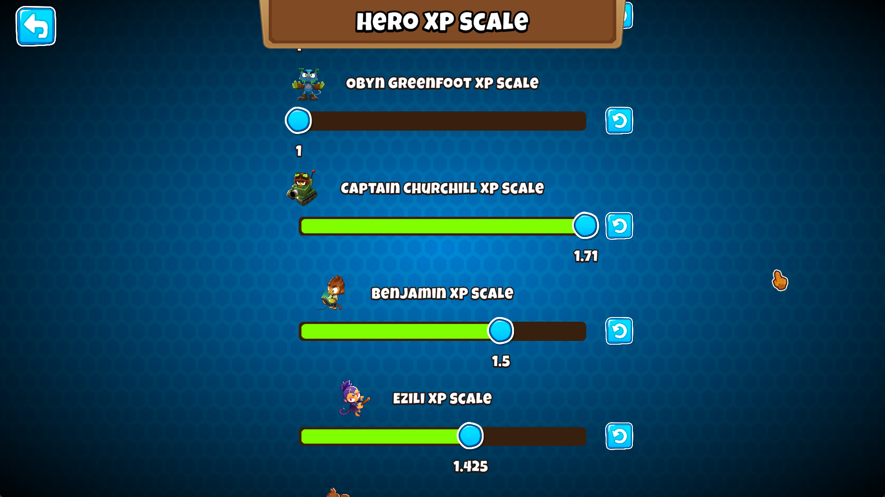
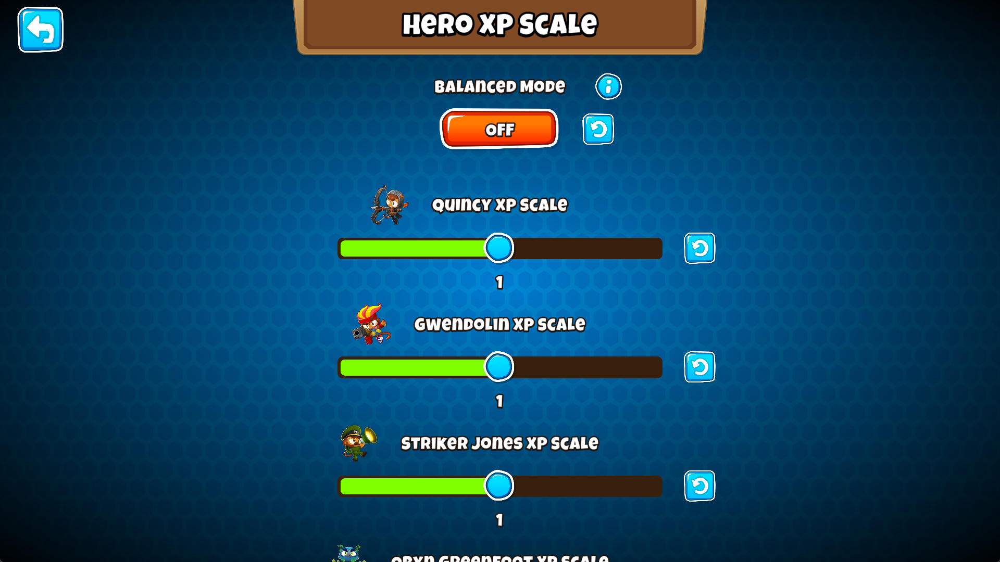

<h1 align="center">

Hero XP Scale
</h1>

## Configure the XP Scales for BTD6 Heroes

Adds Mod Settings to customize the level up xp requirements for all heroes, including modded ones.

From the [BTD6 Wiki](https://bloons.fandom.com/wiki/Heroes)

> All heroes have a specific XP ratio. Heroes with a higher XP ratio require more XP to level up and therefore level up slower.
> - All four base heroes (Quincy, Gwendolin, Striker Jones, Obyn Greenfoot) as well as Etienne and Geraldo have an XP ratio of 1x.
> - Ezili, Pat Fusty, Admiral Brickell, Sauda and Rosalia have a 1.425x XP ratio.
> - Benjamin and Psi have an XP ratio of 1.5x.
> - Captain Churchill, Adora, and Corvus have an XP ratio of 1.71x.

You can also turn off the Balanced Mode setting to make the sliders go beyond 1x and 1.71x.

